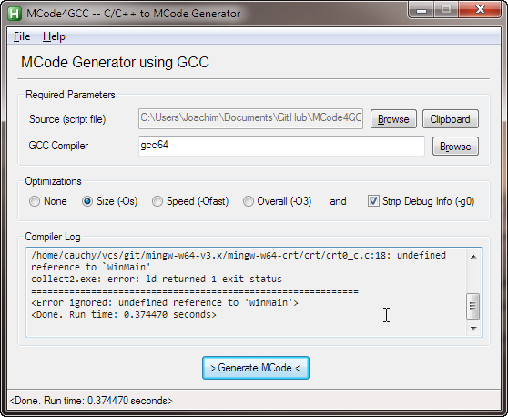
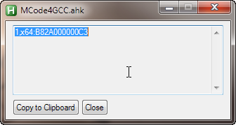

MCode4GCC
==================
  
MCode4GCC is an MCode generator using the GCC Compiler.  
More about MCode here:  
http://ahkscript.org/boards/viewtopic.php?f=7&t=32
  
### Screenshots

  
### To do
- Base64 output instead of Hex
- more (?)
  
------
  
Special thanks to IsNull, fincs and kon  
Written by joedf  
Released under the MIT License  